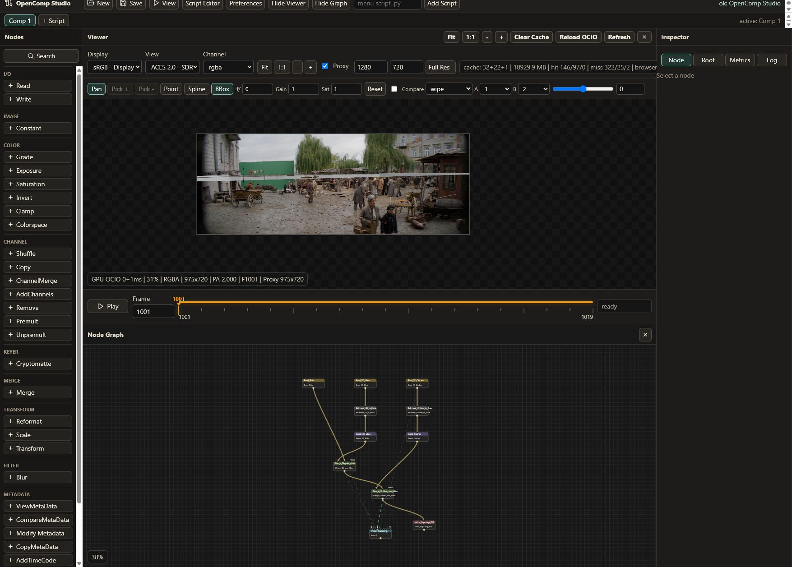

# Introduction to OpenComp Studio

OpenComp Studio is a local node-based compositing prototype aimed at Nuke-like workflows in a browser UI. It focuses on image I/O, EXR/ACES/OCIO workflows, a canvas node graph, a canvas viewer, viewer-side color controls, playback caching, metadata inspection, and a Python script editor for graph automation.

The current app is not a finished production compositor. It is a working foundation for:

- reading image sequences
- building node graphs
- evaluating frames through a backend image engine
- previewing images through a GPU-assisted browser viewer
- writing rendered output
- inspecting channels, metadata, cache status, and node timings
- scripting node creation and graph edits through a Python-like API

## Current User Experience

The main UI is split into:

- Top application bar: project actions, script editor, preferences, panel toggles.
- Left node menu: categorized nodes such as Read, Write, Grade, Merge, Reformat, Shuffle, Cryptomatte.
- Viewer panel: image canvas, display/view/channel controls, proxy/full-res controls, viewer gain/saturation/f-stop, compare tools, playback timeline.
- Node graph: canvas-based node editor with top-to-bottom flow.
- Inspector: node properties, root settings, metrics, and logs.



## What Works Now

- Read EXR/PNG/JPG sequences.
- Read EXR metadata, pixel aspect, channel names, display window, and data window.
- Selectively load EXR channels for faster slapcomp workflows.
- Reformat, scale, transform, grade, exposure, saturation, clamp, invert, blur, merge, shuffle, copy channels, premult/unpremult, remove/add channels.
- Viewer node with numbered inputs.
- Viewer switching through active input.
- Viewer pan/zoom without refitting on frame changes.
- Viewer proxy/full-res mode.
- Viewer pre-display gain, saturation, and f-stop.
- Wipe/difference compare architecture.
- Cryptomatte layer discovery, ID preview, pick, and matte generation.
- Backend node cache, preview cache, and float viewer cache.
- Frontend browser viewer cache for fast playback/frame switching.
- Background viewer cache warming.
- Metrics display for node and viewer timing.
- Python script editor for graph automation.
- Write node output to EXR/PNG/JPG.

## How to Run

Windows:

```bat
install.bat
run.bat
```

The backend runs on:

```text
http://127.0.0.1:8000
```

The frontend runs on:

```text
http://127.0.0.1:5173
```

## Typical Workflow

1. Add a Read node.
2. Point it at an image or sequence path.
3. Add color/transform/channel nodes.
4. Add Merge nodes to combine images.
5. Connect the result to a Viewer input.
6. Scrub or play the frame range.
7. Inspect metrics/cache behavior.
8. Add a Write node.
9. Render a frame or sequence.

## Key Design Direction

OpenComp currently uses the backend as the source of truth for graph evaluation and image data. The frontend is a responsive editing and viewing layer. The near-term performance direction is to move from whole-frame processing toward true tile/visible-region processing, while keeping a CPU fallback for every accelerated path.
